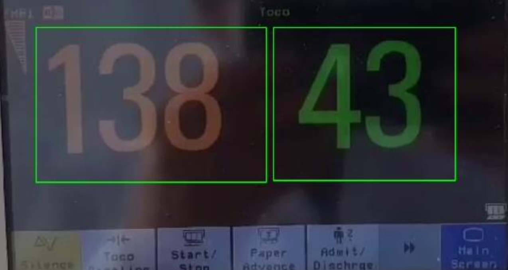

# CTGwPy

A Python program designed to simulate a cardiotocograph (a.k.a. an electronic fetal monitor)

## Description

Cardiotocography is a technical means of recording the fetal hearbeat and the uterine contractions during pregnancy. A cardiotocograph displays those values on the screen and prints out a plot of those values.

This program is designed to:
1) Ask for desired plot rate

2) Read those values from an external camera which is capturing the screen of a cardiotocograph

3) Plot a graph and display color gradients of those values

The program serves as a prototype for further use. For example, one could link the program with a VR glass, in order to keep those values in a safe range by playing appropriate music or videos for the patient.

## Authors

donburi82

## Updates

* 21st May 2022
    * Initial Release

## Acknowledgments

* [README-template](https://gist.github.com/DomPizzie/7a5ff55ffa9081f2de27c315f5018afc)
